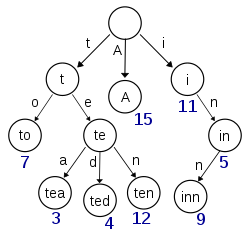

# 트라이(Trie)

## 트라이란?

**트라이(Trie)** 는 탐색 트리의 일종입니다. 동적 집합이나 연관 배열을 저장하는 데 사용되는 트리 자료 구조입니다.



<br />

## 트라이의 특징

- 검색어 자동완성, 사전 찾기 등에 응용될 수 있습니다.
- 문자열을 탐색할 때 단순하게 비교하는 것보다 효율적으로 찾을 수 있습니다.
- L이 문자열의 길이일 때 탐색, 삽입은 O(L)만큼 걸립니다.
- 대신 각 정점이 자식에 대한 링크를 전부 가지고 있기에 저장 공간을 더 많이 사용합니다.

<br />

## 트라이 구조

- 루트는 비어있습니다.
- 각 간선(링크)은 추가될 문자를 키로 가집니다.
- 각 정점은 이전 정점의 값 + 간선의 키를 값으로 가집니다.
- 해시 테이블과 연결 리스트를 이용하여 구현할 수 있습니다.

<br />

## JavaScript에서 사용법

```javascript
class Node {
  constructor(value = '') {
    this.value = value;
    this.children = new Map();
  }
}

class Trie {
  constructor() {
    this.root = new Node();
  }

  insert(string) {
    let currentNode = this.root;

    for (const char of string) {
      if (!currentNode.children.has(char)) {
        currentNode.children.set(char, new Node(currentNode.value + char));
      }

      currentNode = currentNode.children.get(char);
    }
  }

  has(string) {
    let currentNode = this.root;

    for (const char of string) {
      if (!currentNode.children.has(char)) {
        return false;
      }

      currentNode = currentNode.children.get(char);
    }

    return true;
  }
}

const trie = new Trie();

trie.insert('cat');
trie.insert('can');

console.log(trie.has('cat')); // true
console.log(trie.has('can')); // true
console.log(trie.has('cap')); // false
```

<br />

## 참고 자료

> https://programmers.co.kr/learn/courses/13213

> https://ko.wikipedia.org/wiki/%ED%8A%B8%EB%9D%BC%EC%9D%B4_(%EC%BB%B4%ED%93%A8%ED%8C%85)

> 새 창 열기 방법 : CTRL+click (on Windows and Linux) | CMD+click (on MacOS)
