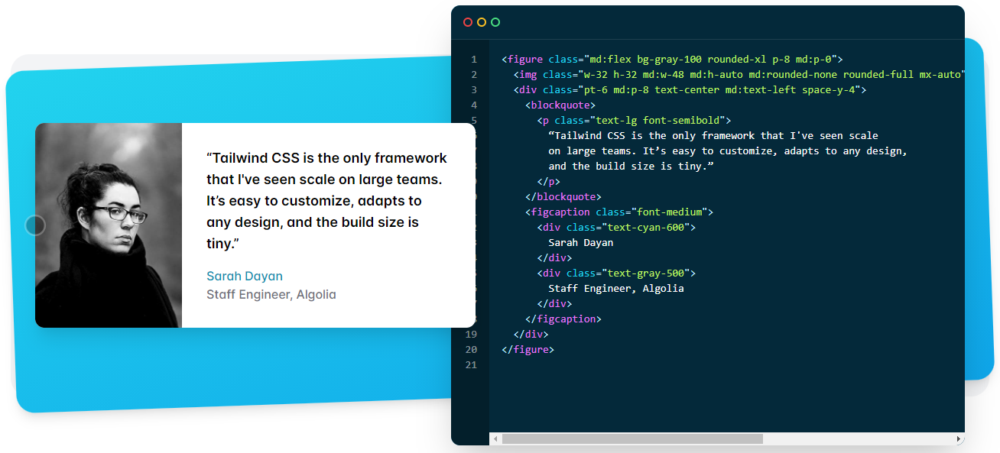
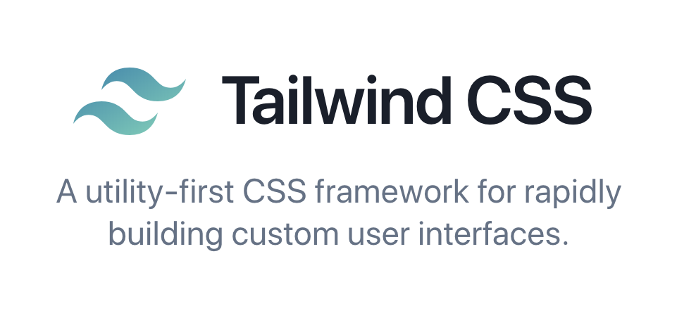

# Atomic & Utility First CSS

## Atomic & Utility First CSS 란 무엇인가?

**Atomic & Utility First CSS** 는 CSS 선언 컨셉 중 하나입니다.

대표적인 Atomic & Utility First CSS 컨셉으로 설계된 CSS 라이브러리는 **Tailwind CSS** 가 있고 아래와 같이 사용합니다.



<br />

### 예시

```HTML
<button class="w-1/2 flex items-center justify-center rounded-md bg-black text-white">Click</button>
```

버튼이라는 클래스 하나를 디자인하기 위해서 유틸리티 클래스들을 위와 같이 여러 개 집어넣어서 조합하는 방식으로 디자인을 완성할 수가 있습니다.

> 이런 형식으로 HTML의 유틸리티 클래스를 사용을 하게 되면 HTML과 CSS의 연결은 굉장히 강력해집니다. 그래서 HTML을 작성하시는 분이 반드시 CSS 개발도 같이 진행해야 합니다.

<br />



[**🔗 Tailwind CSS 바로가기 Click !**](https://tailwindcss.com/) 👈

> 새 창 열기 방법 : CTRL+click (on Windows and Linux) | CMD+click (on MacOS)

<br />

## Atomic & Utility First CSS 의 특징

1. 라이브러리 타입으로 빠른 스타일 구축이 가능합니다.
2. 다른 방법론과 함께 사용 가능합니다.
3. 스타일 관점의 작명을 하여 의미론을 사용하지 않습니다.
4. HTML 코드에 스타일이 강하게 연결됩니다.
5. HTML/CSS 병렬 개발이 불가능합니다. 그렇기에 소규모 팀 또는 단일 엔지니어 개발에 적합합니다.

<br />

## Atomic & Utility First CSS 의 장단점

| 장점                                                                                                                                      | 단점                                                                                                                   |
| :---------------------------------------------------------------------------------------------------------------------------------------- | :--------------------------------------------------------------------------------------------------------------------- |
| 1. 편리함과 빠른 개발<br />2. 일관된 디자인<br />3. 쉽고 자유로운 커스텀<br />4. 로우 레벨의 스타일 제공<br />5. JavaScript 코드와의 분리 | 1. 클린하지 못한 코드<br />2. 클래스명 학습의 러닝 커브<br />3. JavaScript 코드 사용 불가<br />4. HTML과 CSS 코드 혼재 |

<br />

## 참고 자료

> https://tailwindcss.com/

> https://wonny.space/writing/dev/hello-tailwind-css

> https://fastcampus.co.kr/dev_red_jcm

> 새 창 열기 방법 : CTRL+click (on Windows and Linux) | CMD+click (on MacOS)
