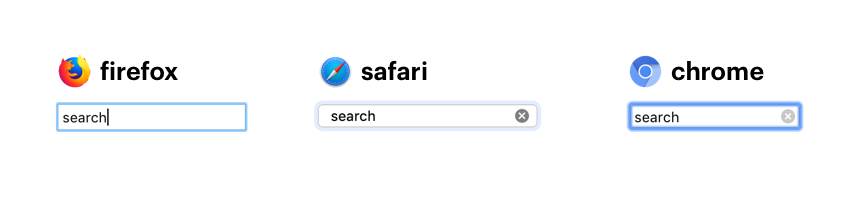
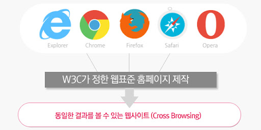

# CSS 리셋

## CSS 리셋이란?

각 브라우저마다 HTML 요소에 설정 되어 있는 기본 스타일이 존재하고 스타일이 다 조금씩 다릅니다. 이는 크로스 브라우징을 방해합니다. 이러한 점을 개선하기 위해 **CSS 스타일 속성을 초기화** 시키는 것입니다.



<br />

### 크로스 브라우징(Cross Browsing)

웹 표준 기술을 사용하여 다른 기종/플랫폼/브라우저에 따라 어느 한쪽에 최적화되어 치우치지 않도록 공통 요소를 사용하여 웹 페이지를 제작하는 기법입니다.  
즉, 어느 브라우저 또는 기기에서 사이트가 웹 사이트가 **동일하게** 보여지고 작동되도록 하는 기법입니다.



<br />

## CSS 리셋 방법

### reset.css

- HTML 파일에 `link` 태그를 이용한 적용 방법

```HTML
<link rel="stylesheet" href="https://cdn.jsdelivr.net/npm/reset-css@5.0.1/reset.min.css" />
```

- CSS 파일에 직접 적용 방법

```CSS
/* http://meyerweb.com/eric/tools/css/reset/
   v2.0 | 20110126
   License: none (public domain)
*/

html, body, div, span, applet, object, iframe,
h1, h2, h3, h4, h5, h6, p, blockquote, pre,
a, abbr, acronym, address, big, cite, code,
del, dfn, em, img, ins, kbd, q, s, samp,
small, strike, strong, sub, sup, tt, var,
b, u, i, center,
dl, dt, dd, ol, ul, li,
fieldset, form, label, legend,
table, caption, tbody, tfoot, thead, tr, th, td,
article, aside, canvas, details, embed,
figure, figcaption, footer, header, hgroup,
menu, nav, output, ruby, section, summary,
time, mark, audio, video {
	margin: 0;
	padding: 0;
	border: 0;
	font-size: 100%;
	font: inherit;
	vertical-align: baseline;
}
/* HTML5 display-role reset for older browsers */
article, aside, details, figcaption, figure,
footer, header, hgroup, menu, nav, section {
	display: block;
}
body {
	line-height: 1;
}
ol, ul {
	list-style: none;
}
blockquote, q {
	quotes: none;
}
blockquote:before, blockquote:after,
q:before, q:after {
	content: '';
	content: none;
}
table {
	border-collapse: collapse;
	border-spacing: 0;
}
```

> https://meyerweb.com/eric/tools/css/reset/

> 마지막 업데이트: 2011년 1월

<br />

### normalize.css

- HTML 파일에 `link` 태그를 이용한 적용 방법

```HTML
<link rel="stylesheet" href="https://cdn.jsdelivr.net/npm/normalize.css@8.0.1/normalize.min.css" />
```

- CSS 파일에 직접 적용 방법

```CSS
/*! normalize.css v8.0.1 | MIT License | github.com/necolas/normalize.css */

/* Document
   ========================================================================== */

/**
 * 1. Correct the line height in all browsers.
 * 2. Prevent adjustments of font size after orientation changes in iOS.
 */

html {
  line-height: 1.15; /* 1 */
  -webkit-text-size-adjust: 100%; /* 2 */
}

/* Sections
   ========================================================================== */

/**
 * Remove the margin in all browsers.
 */

body {
  margin: 0;
}

/**
 * Render the `main` element consistently in IE.
 */

main {
  display: block;
}

/**
 * Correct the font size and margin on `h1` elements within `section` and
 * `article` contexts in Chrome, Firefox, and Safari.
 */

h1 {
  font-size: 2em;
  margin: 0.67em 0;
}

/* Grouping content
   ========================================================================== */

/**
 * 1. Add the correct box sizing in Firefox.
 * 2. Show the overflow in Edge and IE.
 */

hr {
  box-sizing: content-box; /* 1 */
  height: 0; /* 1 */
  overflow: visible; /* 2 */
}

/**
 * 1. Correct the inheritance and scaling of font size in all browsers.
 * 2. Correct the odd `em` font sizing in all browsers.
 */

pre {
  font-family: monospace, monospace; /* 1 */
  font-size: 1em; /* 2 */
}

/* Text-level semantics
   ========================================================================== */

/**
 * Remove the gray background on active links in IE 10.
 */

a {
  background-color: transparent;
}

/**
 * 1. Remove the bottom border in Chrome 57-
 * 2. Add the correct text decoration in Chrome, Edge, IE, Opera, and Safari.
 */

abbr[title] {
  border-bottom: none; /* 1 */
  text-decoration: underline; /* 2 */
  text-decoration: underline dotted; /* 2 */
}

/**
 * Add the correct font weight in Chrome, Edge, and Safari.
 */

b,
strong {
  font-weight: bolder;
}

/**
 * 1. Correct the inheritance and scaling of font size in all browsers.
 * 2. Correct the odd `em` font sizing in all browsers.
 */

code,
kbd,
samp {
  font-family: monospace, monospace; /* 1 */
  font-size: 1em; /* 2 */
}

/**
 * Add the correct font size in all browsers.
 */

small {
  font-size: 80%;
}

/**
 * Prevent `sub` and `sup` elements from affecting the line height in
 * all browsers.
 */

sub,
sup {
  font-size: 75%;
  line-height: 0;
  position: relative;
  vertical-align: baseline;
}

sub {
  bottom: -0.25em;
}

sup {
  top: -0.5em;
}

/* Embedded content
   ========================================================================== */

/**
 * Remove the border on images inside links in IE 10.
 */

img {
  border-style: none;
}

/* Forms
   ========================================================================== */

/**
 * 1. Change the font styles in all browsers.
 * 2. Remove the margin in Firefox and Safari.
 */

button,
input,
optgroup,
select,
textarea {
  font-family: inherit; /* 1 */
  font-size: 100%; /* 1 */
  line-height: 1.15; /* 1 */
  margin: 0; /* 2 */
}

/**
 * Show the overflow in IE.
 * 1. Show the overflow in Edge.
 */

button,
input { /* 1 */
  overflow: visible;
}

/**
 * Remove the inheritance of text transform in Edge, Firefox, and IE.
 * 1. Remove the inheritance of text transform in Firefox.
 */

button,
select { /* 1 */
  text-transform: none;
}

/**
 * Correct the inability to style clickable types in iOS and Safari.
 */

button,
[type="button"],
[type="reset"],
[type="submit"] {
  -webkit-appearance: button;
}

/**
 * Remove the inner border and padding in Firefox.
 */

button::-moz-focus-inner,
[type="button"]::-moz-focus-inner,
[type="reset"]::-moz-focus-inner,
[type="submit"]::-moz-focus-inner {
  border-style: none;
  padding: 0;
}

/**
 * Restore the focus styles unset by the previous rule.
 */

button:-moz-focusring,
[type="button"]:-moz-focusring,
[type="reset"]:-moz-focusring,
[type="submit"]:-moz-focusring {
  outline: 1px dotted ButtonText;
}

/**
 * Correct the padding in Firefox.
 */

fieldset {
  padding: 0.35em 0.75em 0.625em;
}

/**
 * 1. Correct the text wrapping in Edge and IE.
 * 2. Correct the color inheritance from `fieldset` elements in IE.
 * 3. Remove the padding so developers are not caught out when they zero out
 *    `fieldset` elements in all browsers.
 */

legend {
  box-sizing: border-box; /* 1 */
  color: inherit; /* 2 */
  display: table; /* 1 */
  max-width: 100%; /* 1 */
  padding: 0; /* 3 */
  white-space: normal; /* 1 */
}

/**
 * Add the correct vertical alignment in Chrome, Firefox, and Opera.
 */

progress {
  vertical-align: baseline;
}

/**
 * Remove the default vertical scrollbar in IE 10+.
 */

textarea {
  overflow: auto;
}

/**
 * 1. Add the correct box sizing in IE 10.
 * 2. Remove the padding in IE 10.
 */

[type="checkbox"],
[type="radio"] {
  box-sizing: border-box; /* 1 */
  padding: 0; /* 2 */
}

/**
 * Correct the cursor style of increment and decrement buttons in Chrome.
 */

[type="number"]::-webkit-inner-spin-button,
[type="number"]::-webkit-outer-spin-button {
  height: auto;
}

/**
 * 1. Correct the odd appearance in Chrome and Safari.
 * 2. Correct the outline style in Safari.
 */

[type="search"] {
  -webkit-appearance: textfield; /* 1 */
  outline-offset: -2px; /* 2 */
}

/**
 * Remove the inner padding in Chrome and Safari on macOS.
 */

[type="search"]::-webkit-search-decoration {
  -webkit-appearance: none;
}

/**
 * 1. Correct the inability to style clickable types in iOS and Safari.
 * 2. Change font properties to `inherit` in Safari.
 */

::-webkit-file-upload-button {
  -webkit-appearance: button; /* 1 */
  font: inherit; /* 2 */
}

/* Interactive
   ========================================================================== */

/*
 * Add the correct display in Edge, IE 10+, and Firefox.
 */

details {
  display: block;
}

/*
 * Add the correct display in all browsers.
 */

summary {
  display: list-item;
}

/* Misc
   ========================================================================== */

/**
 * Add the correct display in IE 10+.
 */

template {
  display: none;
}

/**
 * Add the correct display in IE 10.
 */

[hidden] {
  display: none;
}
```

> https://github.com/necolas/normalize.css

> 마지막 업데이트: 2018년 11월

<br />

## reset.css 와 normalize.css의 차이점

**reset.css**는 아예 완전히 백지 상태로 초기화시켜 사용하는 스타일 시트입니다.

**nomalize.css**는 기존의 브라우저별 스타일을 모두 리셋시키는 방법이 아닌, 이를 유지하고, 이용하려는 스타일 시트입니다.

<br />

## CSS 리셋의 문제점

**reset 스타일 시트**와 **normalize 스타일 시트**의 경우 현재 시점에서 굳이 선언하지 않아도 되는 스타일이 대부분입니다. 그래서 Unused CSS, Overridden CSS가 발생합니다. 즉, 사용되지 않거나 또는
그냥 덮어쓰기 되어 버리는 그런 스타일들이 생기는 것입니다.

<br />

## 참고 자료

> https://blog.naver.com/insaweb/221926915225

> https://tuhbm.github.io/2018/02/21/cssReset/

> https://bitsofco.de/a-look-at-css-resets-in-2018/

> http://homepage.akermedia.co.kr/sub/page3.php

> https://meyerweb.com/eric/tools/css/reset/

> https://github.com/necolas/normalize.css

> https://fastcampus.co.kr/dev_red_jcm

> 새 창 열기 방법 : CTRL+click (on Windows and Linux) | CMD+click (on MacOS)
