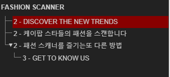

# HTML 개요 알고리즘

## Outline ?

"개요, 윤곽", "간결하게 추려 낸 주요 내용", "웹 문서의 개요는 헤딩과 섹션으로 형성"

### Headings Map

|                         헤딩이 잘 구성된 구조                         |                    헤딩이 잘 구성지 않은 구조                     |
| :-------------------------------------------------------------------: | :---------------------------------------------------------------: |
|  |  |

<br />

## Heading 이란?

**Heading**은 문서 개요를 형성하는 기본(==필수) 아이템입니다. 그리고 웹 브라우저와 화면낭독기에 문서 개요를 드러내는 방법이기도 합니다.

> Heading 태그는 `<h1>` ~ `<h6>` 6단계의 구획 제목을 나타냅니다. `<h1>` 이 가장 높고 `<h6>` 은 가장 낮습니다.

### HTML ⇌ 브라우저 / 화면낭독기

- HTML

  ```html
  <h1>A</h1>
  <h2>B</h2>
  <h3>C</h3>
  ```

- 브라우저 / 화면낭독기

  ```
  - A
    - B
      - C
  ```

즉, `<Heading>` 없이는 문서의 개요도 없습니다.

<br />

## Title과 Heading의 차이는?

`<title>` 요소는 문서의 제목

> 문서에서 **한 번만** 사용할 수 있다.

`<h*>` 요소는 섹션의 제목

> 문서에서 **여러 번** 사용할 수 있다.

<br />

## Sectioning Content

**Sectioning Content**는 HTML5에서 새롭게 추가된 명세입니다.  
명시적 개요를 생성하는 개요 컨테이너이며 적절한 수준의 헤딩을 자식 요소로 사용해야 합니다.

### Sectioning Content 태그 종류

- `<article>` : 기사, 본문, 맥락 독립적으로 배포가 가능
- `<aside>` : 페이지의 주요 내용이 아닌 부수적인 부분
- `<nav>` : 사이트의 주된 탐색 메뉴
- `<section>` : 주제별로 나누거나 묶는

### HTML ⇌ 브라우저 / 화면낭독기

- HTML

  ```html
  <h1>A</h1>
  <article>
    <h2>B</h2>
    <section>
      <h3>C</h3>
    </section>
  </article>
  ```

- 브라우저 / 화면낭독기

  ```
  - A
    - B
      - C
  ```

> 섹셔닝 요소를 적극 사용하되 아웃라인 알고리즘(섹셔닝 루트, 헤딩 수준 자동 보정)명세에는 의존하지 말 것

<br />

## 명시적 섹션

**명시적 섹션**은 헤딩과 함께 <u>섹셔닝 콘텐츠(article, aside, nav, section)를 사용</u> 하여 섹션의 범위를 명시적으로 알 수 있는 섹션입니다.

```html
<h1>A</h1>
<article>
  <h2>B</h2>
  <section>
    <h3>C</h3>
  </section>
</article>
```

<br />

## 암시적 섹션

**암시적 섹션**은 섹셔닝 콘텐츠(article, aside, nav, section)를 사용하지 않고 <u>헤딩만을 사용</u>하여 암시적으로 개요가 생성된 섹션입니다.

```html
<h1>A</h1>
<h2>B</h2>
<h3>C</h3>
```

<br />

## 어색한 섹션

### 최상위 헤딩이 없는 경우

- HTML

  ```html
  <body>
    <p>A</p>
    <article>
      <h2>B</h2>
    </article>
  </body>
  ```

- 브라우저 / 화면낭독기

  ```
  - ?
    - B
  ```

### 헤딩이 없는 경우

- HTML

  ```html
    <article>
      <p>A</p>
      <scection>
        <p>B</p>
      </section>
    </article>
  ```

- 브라우저 / 화면낭독기

  ```
  - ?
    - ?
  ```

<br />

## 참고 자료

> https://developer.mozilla.org/ko/docs/Web/HTML/Element/Heading_Elements

> https://fastcampus.co.kr/dev_red_jcm

> 새 창 열기 방법 : CTRL+click (on Windows and Linux) | CMD+click (on MacOS)
