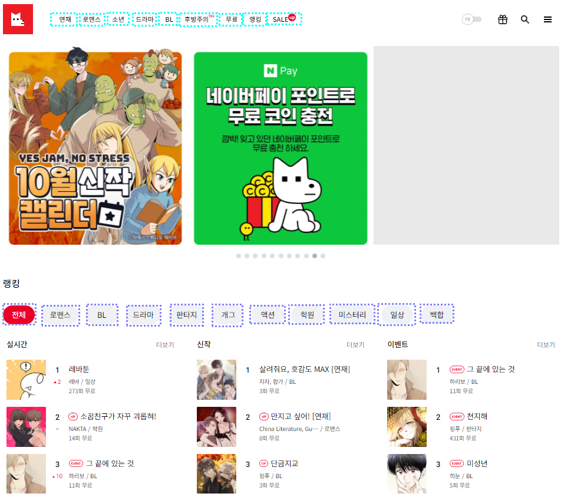
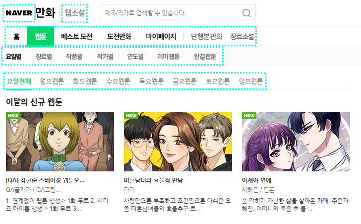
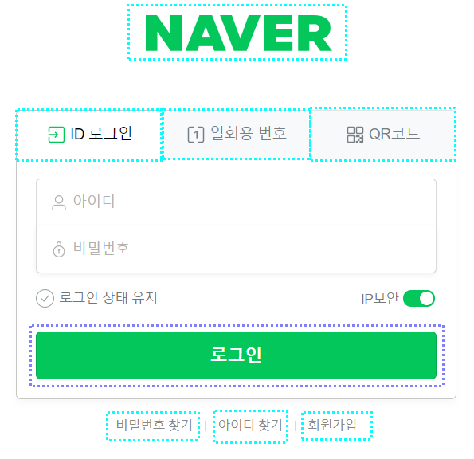
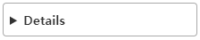
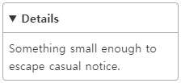
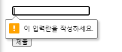
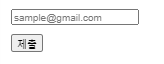
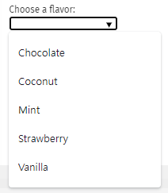

# 상호작용 콘텐츠의 올바른 용법

## 인터렉티브 콘텐츠 (Interactive Content)

**인터렉티브 콘텐츠(Interactive Content)** 는 사용자와 상호 작용할 수 있는 콘텐츠를 의미합니다.

아래의 요소들이 해당합니다.

`a, audio, button, details, embed, iframe, img, input, label, select, texture, video`

> 입력 장치(키보드, 마우스)로 조작할 수 있습니다.

<br />

## `<a>`와 `<button>` 요소의 차이

`<a>`와 `<button>` 요소는 쓰임이 비슷해 보이지만 전혀 다른 용도로 사용됩니다. 그러므로 용도에 따라 구별해서 사용해야 합니다.

`<a>` 요소는 실행결과를 가리킬 수 있는 URL이 있을 때 사용합니다. 반대로 참조할 URL이 없으면 `<button>` 요소를 사용합니다.







> 민트색 : `<a>` / 보라색 : `<button>`

위와 같이 탭을 크릭하면 페이지 전체를 갱신하거나 URL 구조가 바뀌는 것에 **`<a>` 요소**를 사용합니다.

타겟 URL을 설정하지 않는 상황에서는 **`<button>` 요소**를 사용합니다.

<br />

## `<a>` 요소의 target 속성

```HTML
<a
  href="https://www.naver.com"
  target="_blank"
/>
```

보통 새 창으로 문서를 띄울 때 `<a>` 요소의 target 속성에 "\_blank"로 설정하여 사용합니다. 하지만 이때 주의할 점이 하나 있습니다. 바로 자식 창에서 부모 창의 제어 권한을 획득할 수 있습니다. 즉 자바스크립트를 이용해서 사용자가 모르는 사이에 부모 페이지를 다른 페이지로 바꿔치는 것입니다. 이것을 **탭 가로채기(tapnabbing) 공격**이라고 합니다.

> 새 창으로 열린 외부 페이지 B는 자바스크립트 window.opener 객체를 통해 부모 페이지 A의 제어 권한을 획득합니다.

이 문제를 HTML로 해결할 수 있습니다.

```HTML
<a
  href="https://www.naver.com"
  target="_blank"
  rel="noopener noreferrer"
/>
```

> **<u>noopener</u>** 값은 window.opener 객체를 제거
> **<u>noreferrer</u>** 값은 window.opener 제어 불능

> 최신 브라우저는 `target="_blank"` 링크에 `rel="noopener"` 속성을 암시적으로 적용하고 있습니다. 그러나 <u>noopener</u>를 지원하지 않는 낡은 브라우저를 위해 `rel="noopener noreferrer` 속성을 명시하는 것이 좋습니다.

다음과 같이 rel 속성을 설정하면 탭 가로채기 공격을 방어할 수 있습니다.

<br />

## `<details>`, `<summary>` 요소

열림 상태일 때 정보를 표시하는 위젯에 사용하기 적합합니다.

details 요소에 open 속성을 넣으면 열린 상태로 표시됩니다.

summary 요소는 details 요소의 나머지 부분에 대한 요약, 캡션, 범례를 의미하고 숨겨진 폼(form)을 드러내기도 합니다.

```HTML
<details>
  <summary>Details</summary>
  Something small enough to escape casual notice.
</details>
```




<br />

## `<input>` 요소

**`<input>` 요소**의 동작 방식은 type 특성에 따라 현격히 달라지는 요소입니다.

### type 유형

|      유형      |                                                  설명                                                   |
| :------------: | :-----------------------------------------------------------------------------------------------------: |
|     button     |                     기본 행동을 가지지 않으며 value 을 레이블로 사용하는 푸시 버튼                      |
|    checkbox    |                            단일 값을 선택하거나 선택 해제할 수 있는 체크박스                            |
|     color      |                                       색을 지정할 수 있는 컨트롤                                        |
|      date      |                                      날짜를 지정할 수 있는 컨트롤                                       |
| datetime-local |                                   날짜와 시간을 지정할 수 있는 컨트롤                                   |
|     email      |                                    이메일 주소를 편집할 수 있는 필드                                    |
|      file      |        파일을 지정할 수 있는 컨트롤, accept 특성을 사용하면 허용하는 파일 유형을 지정할 수 있음         |
|     hidden     |                                보이지 않지만 값은 서버로 전송하는 컨트롤                                |
|     image      |                          src 특성에 지정한 이미지로 나타나는 시각적 제출 버튼                           |
|     month      |                                     연과 월을 지정할 수 있는 컨트롤                                     |
|     number     |                                       숫자를 입력하기 위한 컨트롤                                       |
|    password    |                                      값이 가려진 한 줄 텍스트 필드                                      |
|     radio      |             같은 name 값을 가진 여러 개의 선택 중에서 하나의 값을 선택하게 하는 라디오 버튼             |
|     range      | 디폴트 값이 중간값인 범위 위젯으로 표시, 접속사 min 과 max 사이에 수용되며 수용 가능한 값의 범위를 정의 |
|     reset      |                               양식의 내용을 디폴트값으로 초기화하는 버튼                                |
|     search     |                                검색 문자열을 입력하는 한 줄 텍스트 필드                                 |
|     submit     |                                          양식을 전송하는 버튼                                           |
|      tel       |                                       전화번호를 입력하는 컨트롤                                        |
|      text      |                                     디폴트 값, 한 줄의 텍스트 필드                                      |
|      time      |                                 시간대가 없는 시간 값을 입력하는 컨트롤                                 |
|      url       |                                           URL을 입력하는 필드                                           |
|      week      |                   시간대가 없는 주-년 값과 주의 값을 구성하는 날짜를 입력하는 컨트롤                    |

<br />

### required 속성

**required 속성**이 명시되어 있는 `<input>` 요소에 사용자가 그 인풋을 작성하지 않으면 브라우저에 내장된 에러 또는 도움말 메시지를 표시해 줍니다.

```HTML
  <input type="text" required />
  <input type="password" required />
```



### placeholder 속성

컨트롤에 초기값이 없을 때 사용자에게 데이터 입력을 지원하기 위해 제공하는 짧은 힌트나 샘플

> label 대안으로는 사용하지 말 것.

```HTML
  <input type="email" placeholder="sample@gmail.com" />
```



<br />

## `<datalist>` 요소

**`<datalist>` 요소**는 다른 컨트롤을 위해 미리 정의된 옵션 세트를 의미합니다.

```HTML
<label for="ice-cream-choice">Choose a flavor:</label>
<input list="ice-cream-flavors" id="ice-cream-choice" name="ice-cream-choice" />

<datalist id="ice-cream-flavors">
  <option value="Chocolate" />
  <option value="Coconut" />
  <option value="Mint" />
  <option value="Strawberry" />
  <option value="Vanilla" />
</datalist>
```

> input 요소의 list 속성 값 === datalist 요소의 id 값

> 두 값이 동일해야 연결된다.



<br />

## 참고 자료

> https://developer.mozilla.org/ko/docs/Web/HTML/Element/details

> https://developer.mozilla.org/ko/docs/Web/HTML/Element/Input

> https://developer.mozilla.org/ko/docs/Web/HTML/Element/datalist

> https://fastcampus.co.kr/dev_red_jcm

> 새 창 열기 방법 : CTRL+click (on Windows and Linux) | CMD+click (on MacOS)
