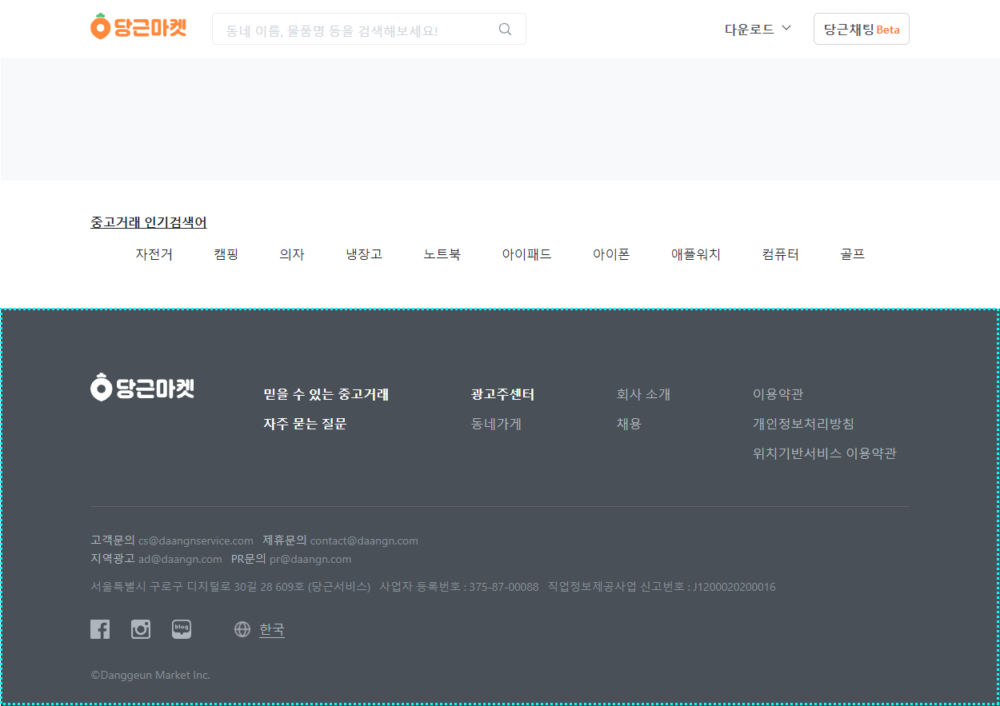
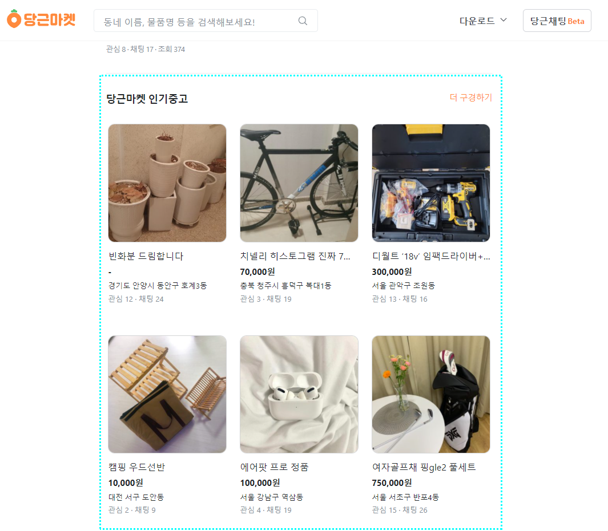
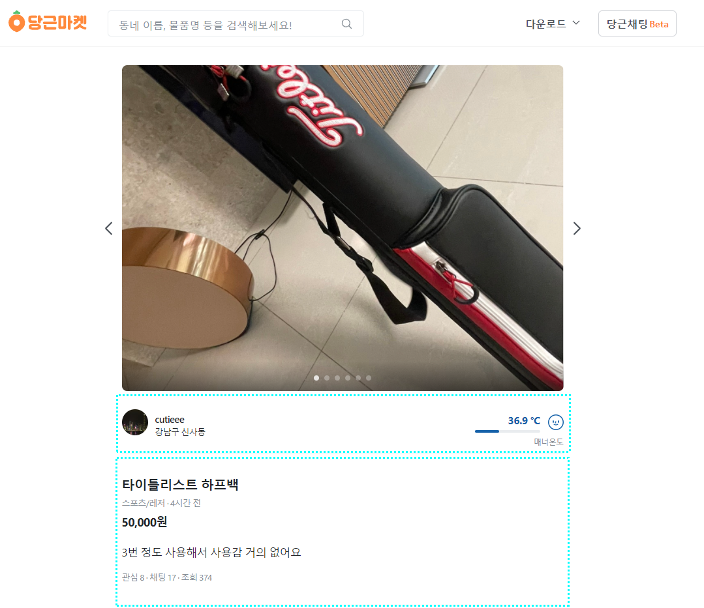
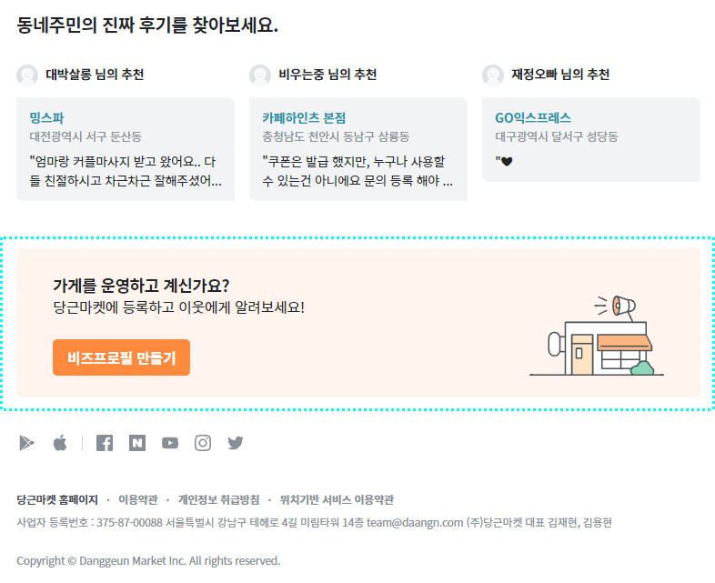
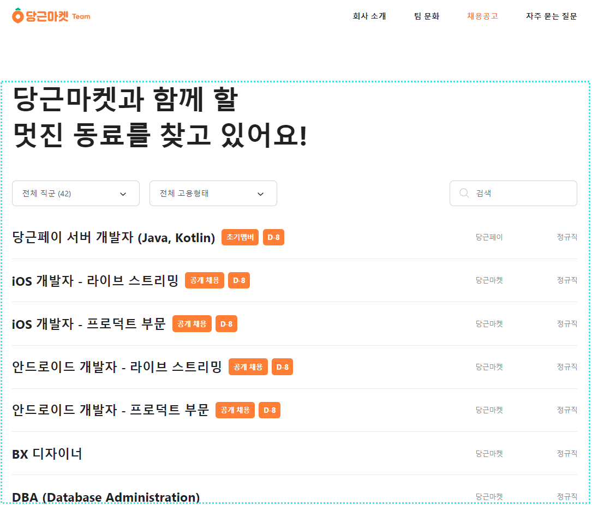
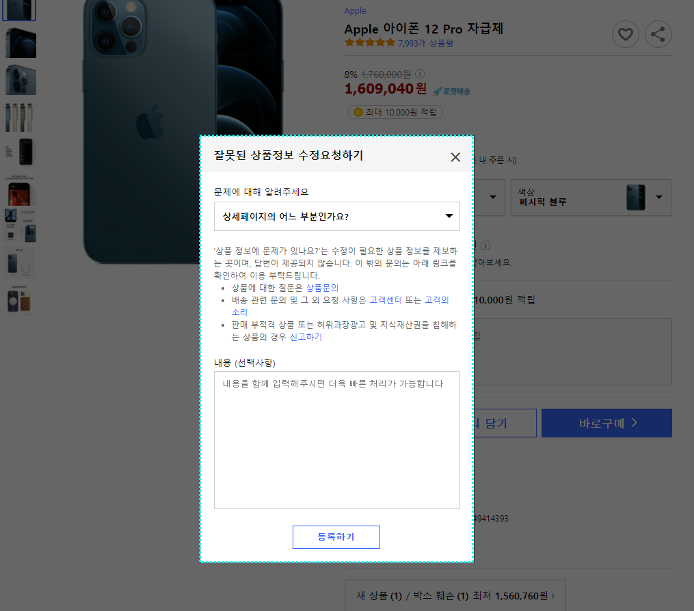
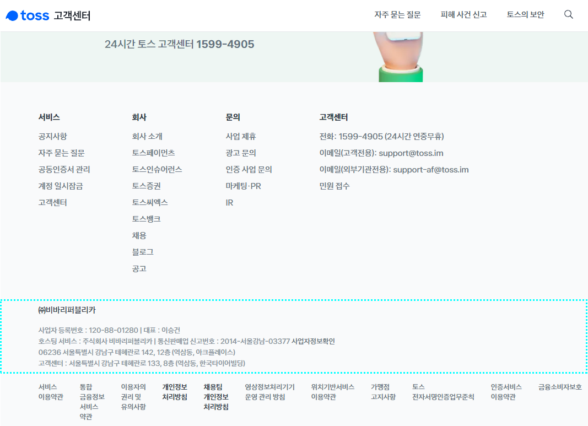
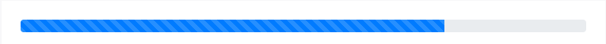

# HTML 의미론

## `
`, `` 요소의 의미

`
`, `` 요소는 아무런 의미가 없습니다. 만약 `
`, `` 요소를 너무 많이 사용하고 있다면 그만큼 HTML 태그를 의미 적절하게 사용하지 않고 있다는 것으로 해석할 수도 있습니다.

`
`, `` 요소는 다른 적절한 HTML 요소를 사용할 수 없을 때 마지막으로 선택할 수 있는 태그입니다.

### 
 요소를 대체할 만한 요소들

`h1, h2, h3, h4, h5, p, ul, ol, li, dl, dt, dd, blockquote, pre, address, article, nav, section, hgroup, header, footer, main, figure, figcaption, details, summary, dialog, datalist ...`

###  요소를 대체할 만한 요소들

`a, em, strong, label, q, sub, sup, ins, del, code, dfn, abbr, cite, kbd, ruby, samp, var, small, b, u, i, s, data, time, mark, output, meter, progress ...`

 

## Sectioning

`article`, `aside`, `nav`, `section` 요소들이 섹셔닝 요소입니다.

`hx`, `hgroup`, `header`, `footer` 요소들은 섹셔닝 요소는 아니지만 함께 쓰이는 요소입니다.

 

## 테그들의 역할

- `<header>`

  도입부, 헤딩, 헤딩 그룹, 목차, 검색, 로고

  

  > 반드시 필요한 요소는 아니지만 이런 의미일 때 div 요소 대신 사용하는 것을 권장합니다.

 

- `<footer>`

  저자, 저작권, 연락처, 관련 문서

  

  > 반드시 필요한 요소는 아니지만 이런 의미일 때 div 요소 대신 사용하는 것을 권장합니다.

 

- `<section>`

  제목이 있는 **주제별 콘텐츠 그룹** 또는 응용 프로그램 영역

  

  > h1 ~ h6 요소를 포함하는 것을 강력하게 권장합니다.

  > header, footer 요소를 사용하는 것은 선택 사항

 

- `<article>`

  섹션 요소 중 **독립적으로 배포 가능한 완결형 콘텐츠**, 뉴스 기사, 블로그 본문, 사용자의 댓글 등

  

  > h1 ~ h6 요소를 포함하는 것을 강력하게 권장합니다.

  > header, footer 요소를 사용하는 것은 선택 사항

 

- `<nav>`

  현재 사이트 또는 현재 페이지 일부를 링크하고 있는 주요 탐색 섹션

  

  > h1 ~ h6 요소를 포함하는 것을 강력하게 권장합니다.

  > 사이트 또는 페이지의 주요 탐색 경로에 해당하지 않는 빵부스러기 링크, 풋터의 약관, 저작권 고지 같은 링크는 nav 요소로 적절하지 않습니다.

 

- `<aside>`

  페이지의 주된 내용과 관련이 약해서 구분할 필요가 있는 섹션

  부수적인 콘텐츠, 관련 기사, 광고 등의 내용을 포함할 수 있습니다.

  

  > h1 ~ h6 요소를 포함하는 것을 강력하게 권장합니다.

 

- `<main>`

  문서의 핵심 주제 또는 애플리케이션의 핵심 기능과 직접 관련 있는 콘텐츠 영역을 의미

  페이지마다 반복되지 않는 내용을 포함해야 합니다.

  섹셔닝 콘텐츠가 아니므로 hx, header, footer 요소의 범위와는 관련이 없습니다.

  하나의 페이지 안에서 하나의 main 요소만 표시할 수 있고 섹셔닝 관련 요소(artice, aside, nav, section, header, footer)의 자식이 될 수 없습니다.

  body, div 요소를 제외한 다른 요소의 자손이 될 수 없습니다.

  

 

- `<dialog>`

  사용자와 상호 작용하는 응용프로그램(대화상자)을 의미

  open 속성을 추가하면 대화 상자가 활성화되고 사용자가 대화 상자를 통해 상호 작용할 수 있습니다.

  

  > 보통 입력 양식과 콘트롤을 포함하고 있으며 닫기 기능을 제공해야 합니다. 그리고 키보드 초점이 dialog 요소 내부에서 순환하도록 처리해야 합니다.

 

- `<figure>`

  문서의 주된 흐름을 위해 참조하는 독립적인 완결형 요소로서 이미지, 도표, 코드 등의 내용물과 설명(figcaption)을 포함합니다.

  선택적으로 처음 또는 마지막에 figcaption 요소를 자식 요소로 포함할 수 있고 또는 생략할 수 있습니다.

  

  > figure 안에서 figcaption 요소가 선언 된다면 한 번만 선언할 수 있습니다.

 

- `<mark>`

  독자의 주의를 끌기 위한 하이라이트

  현재 독자의 행위나 관심에 따라 강조한 것이며 검색 결과 목록에서 사용자가 입력한 키워드를 나타냅니다.

  

 

- `<address>`

  가까운 조상 article 또는 body 요소를 범위로 하는 관련 연락처 정보 우편 정보를 의미하는 것이 아님에 유의해야 합니다. 흔히 footer 요소에 나타납니다.

  

  > p 요소의 자손이 될 수 없습니다.

 

- `<ins>`, `<del>`

  `<ins>`는 <u>추가한 내용</u>을 의미  
  `<del>`는 ~~삭제한 내용~~을 의미

  > 콘텐츠 모델이 투명해서 어떤 요소라도 포함할 수 있습니다. 단 여러 단락을 한꺼번에 포함하는 것은 부적절합니다.

 

- `<progress>`

  계산 또는 사용자 과업의 진척도를 의미합니다.

  원격 호스트의 응답을 기다려야 하는 경우도 있을 수 있기 때문에 진척도는 정확하지 않을 수 있습니다.

  

  > 낡은 브러우저를 위해 value 값과 별도로 콘텐츠를 제공하는 것이 좋습니다.

 

- `<b>`, `<i>`, `<s>`, `<u>`

  과거에는 의미가 없는 요소였으나 현재 특별한 의미로 남아있는 요소들입니다.

  `<b>`: **강조할 의도가 없는 볼드** / `<strong>`: **요소를 고려할 것**  
  `<i>`: _현재 맥락과 다른 분위기_ / `<em>`: _요소를 고려할 것_  
  `<s>`: ~~정확하지 않거나 관련 없는~~ / `<del>`: 요소를 고려할 것~~  
  `<u>`: <u>오타, 중국 교유명사 등의 표기</u> / `<ins>`: <u>요소를 고려할 것</u>

 

## 참고 자료

> https://fastcampus.co.kr/dev_red_jcm

> https://www.daangn.com/

> 새 창 열기 방법 : CTRL+click (on Windows and Linux) | CMD+click (on MacOS)
