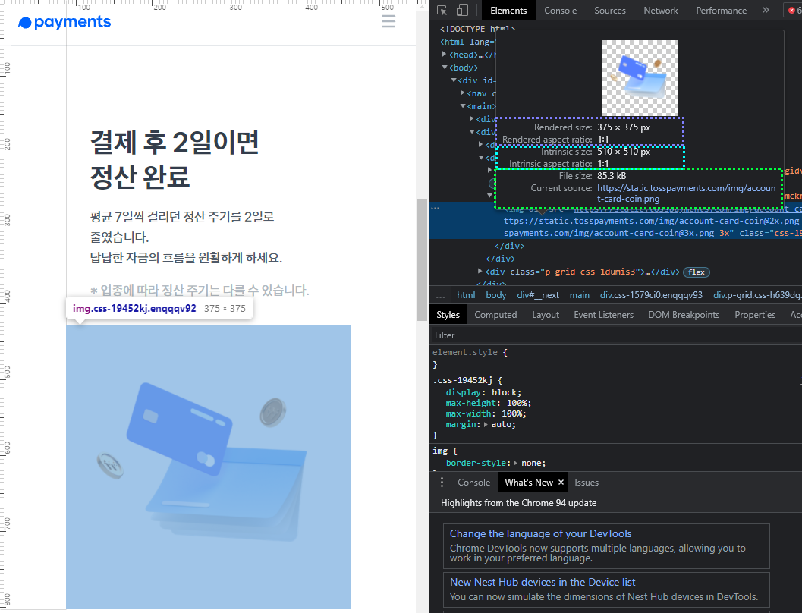

# HTML 이미지 마크업 최적화

## 이미지 마크업 최적화로 얻을 수 있는 것은?

이미지 파일을 최적화시키고 이미지 마크업 `<picture>` 요소를 잘 활용한다면 여러 이득을 얻어올 수 있습니다.  
대표적으로 서버 비용을 절약할 수도 있습니다. 그리고 사용자 경험을 아주 작은 기법만으로도 크게 향상시킬 수 있습니다.

<br />

## 이미지 포맷 비교

**.jpg** / **.png** : 모든 브라우저에서 지원하는 폴백 이미지

**.webp** : jpg/png 대비 30 ~ 70% 수준의 용량

> 알파 채널, IE 미지원

**.avif** : 저용량 + 고품질

> 알파 채널, 크롬/삼성 인터넷 지원


<br />

## 효율적인 이미지 제공 로직

```HTML
if ('avif'를 지원하면) {
  // 'avif' 이미지 포맷 파일 출력
} else if ('webp'를 지원하면) {
  // 'webp' 이미지 포맷 파일 출력
} else {
  // 'jpg' 이미지 포맷 파일 출력
}
```

<br />

## `<picture>` 요소

### `<picture>` 요소 type 분기

```HTML
<picture>
  <source srcset="sample.avif" type="image/avif" />
  <source srcset="sample.webp" type="image/webp" />
  
</picture>
```

> 반드시 하나의 이미지만 화면에 표시합니다. 즉, 사용자 환경에 알맞는 최적의 이미지만 화면에 노출하는 기능 탐지를 `<picture>` 요소가 제공하고 있습니다.

> `<picture>`, `<source>` 요소들은 화면에 출력되는 요소는 아닙니다. 단지 ``의 소스를 제공하기 위한 요소일 뿐입니다.

<br />

### `<picture>` 요소 media 분기

```HTML
<picture>
  <source srcset="small-sample.webp" media="(max-width: 960px)" />
  
</picture>
```

> `<picture>` 요소는 **media** 해상도 구간을 이용해서 이미지를 분기할 수 있습니다.

<br />

### `<picture>`, `` 요소 resolution 분기

```HTML
<picture>
  <source srcset="2x.webp 2x, 1x.webp" type="image/webp" />
  
</picture>

```

> `<picture>`, `` 요소는 사용자의 해상도 resolution, 즉 **해상력**으로도 분기할 수 있습니다.

요즘에는 '레티나 디스플레이'라고 부르는 고해상력을 가진 모니터 화면 또는 스마트폰 디스플레이들이 있습니다. 이런 '레티나 디스플레이'의 특징은 일반적인 이미지보다 두 배 더 큰 이미지를 제공해서 강제로 작게 리사이징한 다음에 화면에 출력하면 더 선명하게 보인다는 것입니다. 그럴 때 레티나 디스플레이를 분기할 수 있는 값의 작성 방법이 바로 **'2x'** 입니다. 이렇게 작성하면 레티나 디스플레이 해상도에서만 이 소스를 다운로드해서 화면에 출력합니다.

<br />

## `` 요소의 성능

```HTML

```

`loading="lazy"` 속성을 사용하면 이미지를 지연 로딩 하게 됩니다.

> 웹 페이지를 화면에 출력할 때 보통 뷰포트 안에 보이는 이미지만 먼저 출력하고 뷰포트 아래쪽에 있는, 즉 화면 바깥쪽의 보이지 않는 이미지들은 로딩하지 않습니다. 로딩하거나 출력하지 않다가 사용자가 브라우저를 스크롤 해서 위로 올리면 아래쪽에 있는 이미지가 올라오면서 다운로드하기 시작하고 화면에 표시하기 시작하는 것입니다. 이것을 **'이미지 지연 로딩'** 이라고 부릅니다.

`decoding="async"` 속성을 사용하면 이미지 디코딩을 병렬로 처리 하게 됩니다.

> 이미지 외의 다른 콘텐츠가 웹 페이지에 빠르게 표시되는 것을 도와줍니다.

<br />

## 이미지 요소 디버깅



> 위와 같이 이미지 요소를 디버깅하면 이 이미지가 현재 어떤 소스를 선택해서 출력하고 있는지 알 수 있습니다.

|         표시 종류          |                         설명                         |
| :------------------------: | :--------------------------------------------------: |
|     **Rendered size**      |        현재 화면에 출력하고 있는 출력 사이즈         |
| **Rendered aspect ratio**  |    현재 화면에 출력하고 있는 가로 세로 출력 비율     |
|     **Intrinsic size**     |     현재 화면에 출력하고 있는 소스의 원본 사이즈     |
| **Intrinsic aspect ratio** | 현재 화면에 출력하고 있는 소스의 가로 세로 원본 비율 |
|       **File size**        |                   이미지 파일 크기                   |
|     **Current source**     |            현재 화면에 출력하고 있는 소스            |

<br />

## 내용 정리

1. avif 포맷을 제공하고 webp, jpg를 대체 수단으로 제공하세요.

2. `<picture>`, `<source>`, `` 요소와 srcset, type, media 속성을 적극 활용하세요.

3. 빠른 로딩 속도를 통해 UX를 개선하고 이미지 전송 비용(User/Service)을 절약하세요.

<br />

## 참고 자료

> https://www.lifewire.com/what-is-an-avif-file-5078731

> https://www.tosspayments.com/

> https://fastcampus.co.kr/dev_red_jcm

> 새 창 열기 방법 : CTRL+click (on Windows and Linux) | CMD+click (on MacOS)
