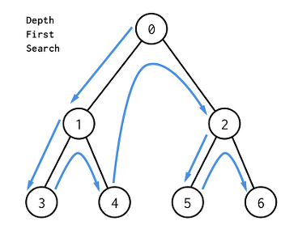

# BFS & DFS

## 너비 우선 탐색(BFS)

**너비 우선 탐색(BFS)** 은 그래프 탐색 알고리즘으로 같은 깊이에 해당하는 정점부터 탐색하는 알고리즘입니다.

### BFS의 특징

- Queue를 이용하여 구현할 수 있습니다.
- 시작 지점에서 가까운 정점부터 탐색합니다.
- V가 정점의 수, E가 간선의 수일 때 BFS의 시간 복잡도는 O(V + E)입니다.

 

## 깊이 우선 탐색(DFS)

**깊이 우선 탐색(DFS)**
은 그래프 탐색 알고리즘으로 최대한 싶은 정점부터 탐색하는 알고리즘입니다.

### DFS의 특징

- Stack을 이용하여 구현할 수 있습니다.
- 시작 정점에서 깊은 것 부터 찾습니다.
- V가 정점의 수, E가 간선의 수일 때 DFS의 시간 복잡도는 O(V + E)입니다.

 

## 참고 자료

> https://programmers.co.kr/learn/courses/13213

> 새 창 열기 방법 : CTRL+click (on Windows and Linux) | CMD+click (on MacOS)
