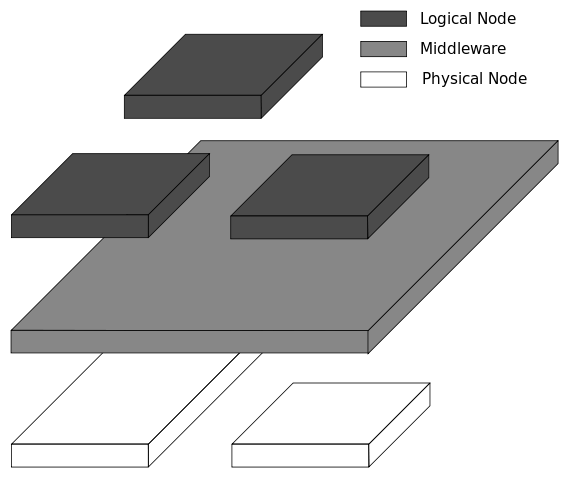

# 미들웨어(Middleware)

## 미들웨어는 무엇인가?

**미들웨어(Middleware)** 는 공통 서비스 및 기능을 애플리케이션에 제공하는 소프트웨어입니다.

데이터 관리, 애플리케이션 서비스, 메시징, 인증 및 API 관리는 주로 미들웨어를 통해 처리됩니다.

미들웨어는 개발자들이 애플리케이션을 보다 효율적으로 구축할 수 있도록 지원하며 애플리케이션, 데이터 및 사용자 사이를 연결하는 요소처럼 작동합니다.

즉 정리하면 미들웨어는 양쪽을 연결하여 데이터를 주고 받을 수 있도록 중간에서 **매개 역할**을 하는 소프트웨어, 네트워크를 통해서 연결된 여러 개의 컴퓨터에 있는 많은 프로세스들에게 어떤 서비스를 사용할 수 있도록 **연결**해주는 소프트웨어를 말합니다.

 

## 참고 자료

> https://www.redhat.com/ko/topics/middleware/what-is-middleware

> https://ko.wikipedia.org/wiki/%EB%AF%B8%EB%93%A4%EC%9B%A8%EC%96%B4

> 새 창 열기 방법 : CTRL+click (on Windows and Linux) | CMD+click (on MacOS)
