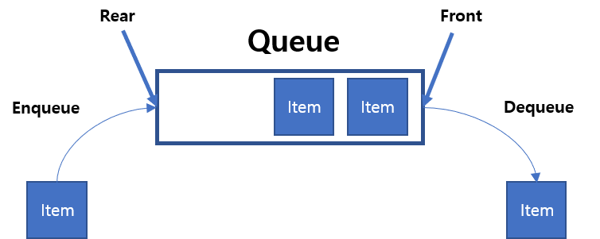
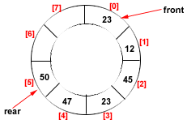

# 큐(Queue)

## 큐란?

**큐(Queue)** 는 FIFO(First In First Out)이라는 개념을 가진 선형 자료구조입니다.  
선형 큐(Linear Queue)와 원형 큐(Circular Queue)가 존재합니다.

<br />

### 선형 큐(Linear Queue)



- 선형 큐(Linear Queue) 배열(Array)로 구현

```javascript
class Queue {
  constructor() {
    this.queue = [];
    this.front = 0;
    this.rear = 0;
  }

  enqueue(newValue) {
    this.queue[this.rear++] = newValue;
  }

  dequeue() {
    const value = this.queue[this.front];

    delete this.queue[this.front];
    this.front += 1;

    return value;
  }

  peek() {
    return this.queue[this.front];
  }

  size() {
    return this.rear - this.front;
  }
}

const queue = new Queue();
```

- 선형 큐(Linear Queue) 연결 리스트(Linked List)로 구현

```javascript
class Node {
  constructor(value) {
    this.value = value;
    this.next = null;
  }
}

class Queue {
  constructor() {
    this.head = null;
    this.tail = null;
    this.size = 0;
  }

  enqueue(newValue) {
    const newNode = new Node(newValue);

    if (this.head === null) {
      this.head = this.tail = newNode;
    } else {
      this.tail.next = newNode;
      this.tail = newNode;
    }

    this.size += 1;
  }

  dequeue() {
    const value = this.head.value;

    this.head = this.head.next;
    this.size -= 1;

    return value;
  }

  peek() {
    return this.head.value;
  }
}

const queue = new Queue();
```

<br />

### 원형 큐(Circular Queue)

원형 큐(Circular Queue)는 Front와 Rear가 이어져있는 Queue입니다.

> 원형 큐(Circular Queue)는 연결 리스트(Linked List)로 구현했을 때에는 이점이 없습니다.



- 원형 큐(Circular Queue) 배열(Array)로 구현

```javascript
class Queue {
  constructor(maxSize) {
    this.maxSize = maxSize;
    this.queue = [];
    this.front = 0;
    this.rear = 0;
    this.size = 0;
  }

  enqueue(newValue) {
    if (this.isFull()) {
      console.log('Queue is full.');
      return;
    }

    this.queue[this.rear] = newValue;
    this.rear = (this.rear + 1) % this.maxSize;
    this.size += 1;
  }

  dequeue() {
    const value = this.queue[this.front];

    delete this.queue[this.front];
    this.front = (this.front + 1) % this.maxSize;
    this.size -= 1;

    return value;
  }

  isFull() {
    return this.size === this.maxSize;
  }

  peek() {
    return this.queue[this.front];
  }
}

const queue = new Queue(4);
```

<br />

## 참고 자료

> https://ko.wikipedia.org/wiki/%ED%81%90_(%EC%9E%90%EB%A3%8C_%EA%B5%AC%EC%A1%B0)

> http://c-ds.blogspot.com/2009/04/circular-queues.html

> 새 창 열기 방법 : CTRL+click (on Windows and Linux) | CMD+click (on MacOS)
